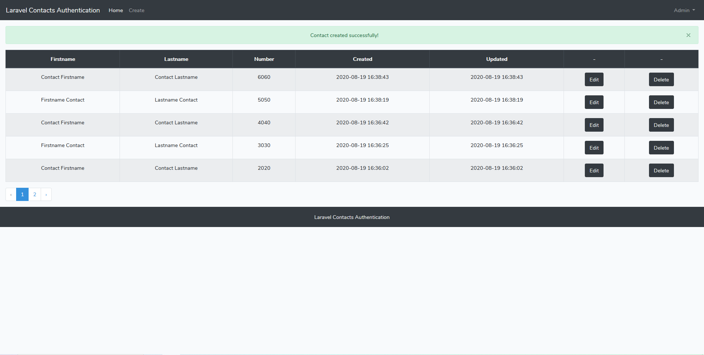
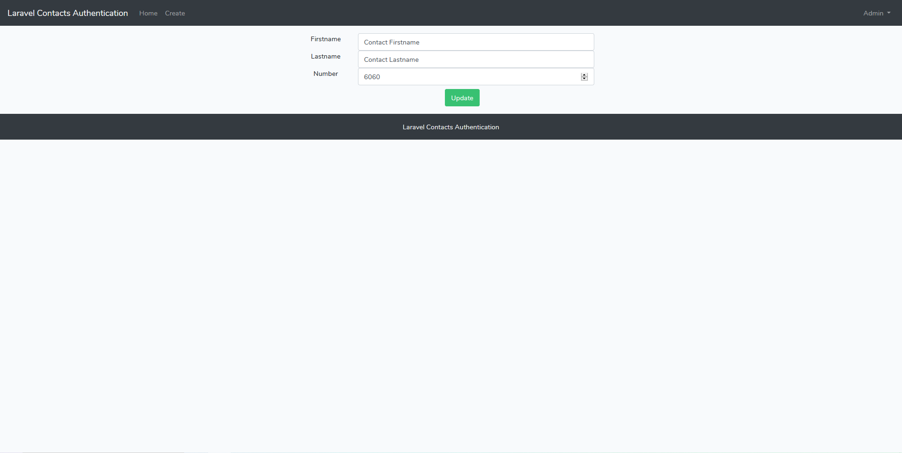
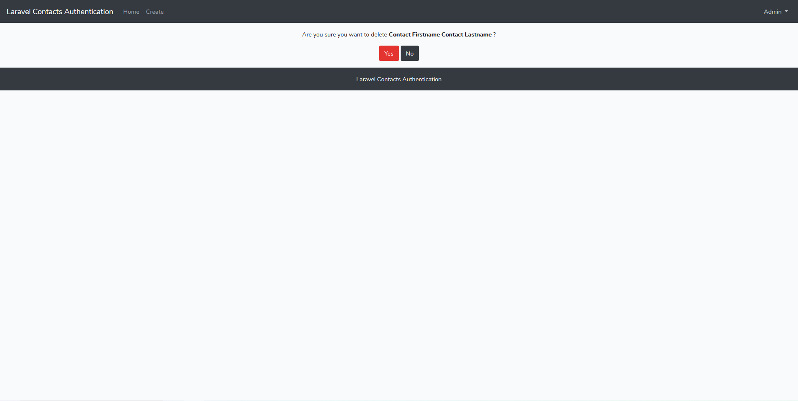
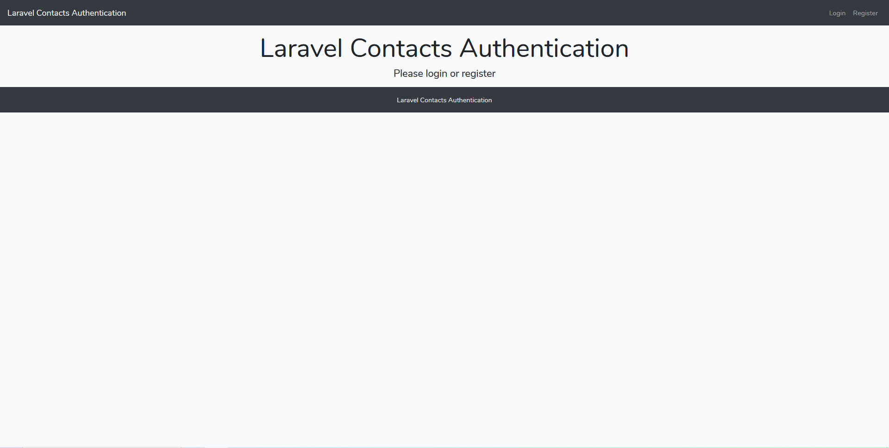
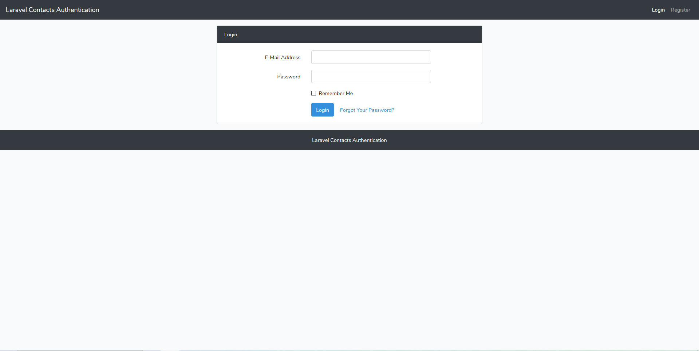
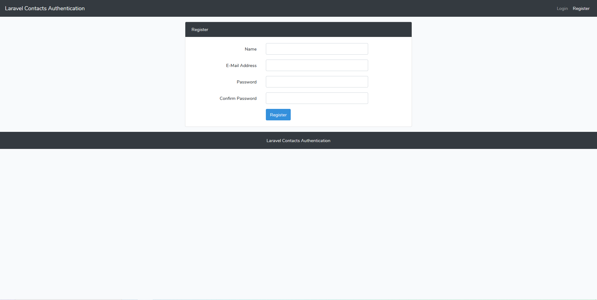

# Laravel Contacts Authentication

A simple Contacts application with Authentication and basic CRUD.

## Installation

01. Install all composer packages
```
composer install
```

02. Copy .env
```
cp .env.example .env
```

03. Set database, database username and database password
```
DB_DATABASE=laravel_contacts_authentication
DB_USERNAME=username
DB_PASSWORD=password
```

04. Generate application key
```
php artisan key:generate
```

05. Do migration
```
php artisan migrate
```

06. Run web server
```
php artisan serve
```

07. Visit http://localhost:8000

## Screenshots 

```
001
```


```
002
```


```
003
```


```
004
```


```
005
```


```
006
```

